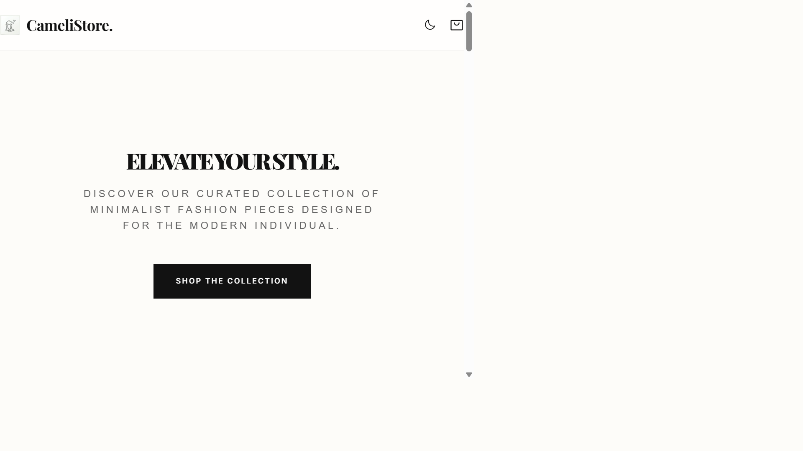

# 🐪 CameliStore — Premium Fashion Ecommerce

CameliStore is a high-end, minimalist ecommerce platform built with a focus on luxury aesthetics and a seamless user experience. This full-stack application provides a complete shopping journey, from product discovery to secure administrative management.



## ✨ Key Features

### 🛍️ Storefront & Customer Experience
- **Luxury UI/UX**: Minimalist, "Apple-inspired" design with glassmorphism, smooth animations, and high-fidelity micro-interactions.
- **Dynamic Catalog**: Browse products with advanced filtering by category, search, and sophisticated sorting options.
- **Product Details**: High-resolution image viewing, detailed descriptions, stock status indicators, and customer reviews.
- **Wishlist & Cart**: Persistent shopping cart and wishlist functionality for guest and authenticated users.
- **Secure Checkout**: Streamlined checkout process with support for Cash on Delivery (COD) and coupon codes.
- **Customer Profiles**: Personal dashboards for tracking orders, managing wishlists, and updating account details.

### 🛡️ Administrative Management
- **Advanced User Control**: Multi-stage account approval system (Pending -> Approved) and status toggling (Active -> Hold).
- **Inventory Management**: Full CRUD operations for products, including featured status and stock tracking.
- **Order Processing**: Real-time order management with status updates (Pending, Processing, Delivered, Cancelled).
- **Coupon System**: Create and manage percentage-based or fixed-amount discount codes.
- **Site Settings**: Centralized control for delivery charges, free shipping thresholds, and general store configuration.

### 🔒 Security & Access Control
- **Role-Based Access (RBAC)**: Distinct permissions for Customers and Administrators.
- **Protected API**: Secure endpoints with session-based authentication.
- **Account Verification**: Manual administrative approval for new registrations to ensure community quality.

## 🛠️ Technology Stack

- **Backend**: Node.js, Express.js
- **Database**: SQLite3 (Fast, lightweight, and zero-configuration)
- **Frontend**: Vanilla JavaScript (ES6+), Modern CSS3 (Custom Design System)
- **Authentication**: Express-Session
- **Icons**: Phosphor Icons

## 🚀 Getting Started

### Prerequisites
- Node.js (v14 or higher)
- npm (Node Package Manager)

### Installation

1. **Clone the repository**
   ```bash
   git clone https://github.com/yourusername/CameliStore.git
   cd CameliStore
   ```

2. **Install dependencies**
   ```bash
   npm install
   ```

3. **Database Setup**
   The application uses SQLite. The database schema and initial seeding (including the default admin account) are handled automatically upon the first run.

4. **Run the application**
   ```bash
   npm start
   ```
   The server will start at `http://localhost:3000`.

### Default Credentials
- **Admin Email**: `admin@example.com` (or username `admin`)
- **Admin Password**: `Abc123@`

## 🎨 Design System

CameliStore uses a custom-built design system defined in `public/css/style.css`:
- **Typography**: Outfit (via Google Fonts)
- **Colors**: Luxury palette (Rich Blacks, Apple Grey `#f5f5f7`, Soft Whites)
- **Grid**: Flexible CSS Grid and Flexbox for fully responsive layouts.

## 📄 License

This project is licensed under the MIT License - see the [LICENSE](LICENSE) file for details.

---

Built with ❤️ for a premium shopping experience.
